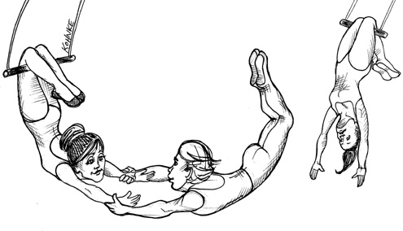
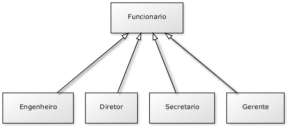
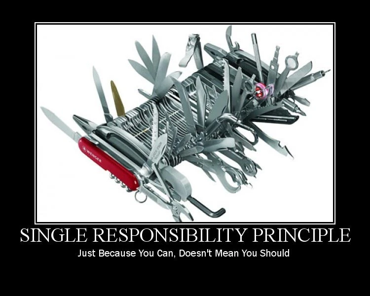
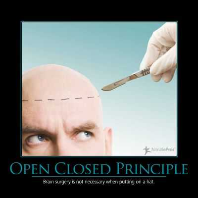
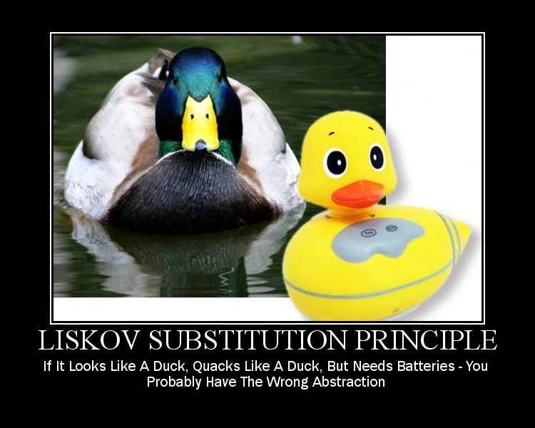
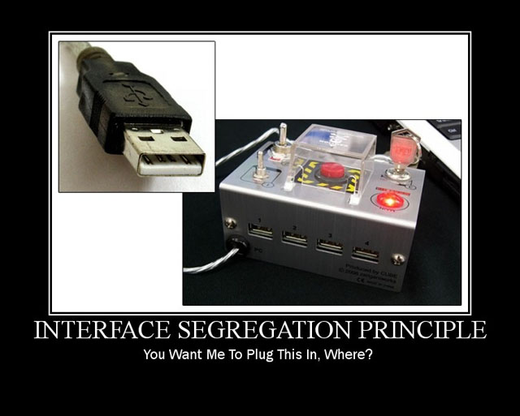

# Solid
Consiste no acrônimo de 5 boas práticas de programação orientada a objetos onde visa auxiliar o programador no seu dia a dia a produzir códigos mais elegantes.
Para iniciarmos esse mini-tutorial iremos esclarecer alguns conceitos antes:

## Coesão
Coesão foi introduzido pelo Robert C. Martin, onde significa que cada classe deve possuir uma única responsabilidade e 
realiza-la de maneira satisfatória, além disso, são classes menores, mais fáceis de serem lidas e mantidas tornando-as mais utilizadas no sistema.
Uma classe que não para de crescer demonstra indício que classe está perdendo a sua coesão.  

#### Simplificando:  
* Uma classe coesa faz bem uma única coisa;  
* Classes coesas não devem ter várias responsabilidades;

Simples assim!

## Acoplamento
Uma classe que depende de uma ou mais classes para funcionar.
O nível de dependência pode tornar a classe dependente frágil para bugs.   
Exemplo: Se classe A depende de B e realizamos mudanças na classe B, logo a mudança poderá afetar a classe A.
Quanto maior a dependêndia de uma classe com outras, maior a probabilidade de uma mudança na dependência afetar o dependente.

### Acoplamento eferente
Quando a classe depende de várias outras classes. (Não é um bom sinal, quando isso ocorre)
### Acoplamento aferente
Quando várias classes dependem de uma classe, demonstrando que essa classe é estável, que não apresentará problemas com exceções/bugs.

#### Simplificando:
* Acoplamento é a dependência entre classes;
* Acoplamento nem sempre é ruim e é impossível criar um sistema sem nenhum acoplamento;
* Devemos controlar o nível de acoplamento na nossa aplicação.

Acoplamento demais pode ser prejudicial ao sistema!

## Encapsulamento
Um código encapsulado esconde como realiza a sua tarefa. Os detalhes de implementação estão escondidos dentro de uma classe/método/função, 
sendo assim nos possibilita alterar o seu comportamento sem impactar as classes que possuem dependência. Um exemplo 
simples que podemos citar são DAOs (Data Access Object).  
Para verificar o nível de encapsulamento se realiza as seguintes perguntas:
* “O que o método faz?”, se conseguirmos responder essa pergunta com apenas o nome do método já é um primeiro passo.
* “Como ele faz isso?”, se não conseguirmos responder essa questão sem adentrar no método já um bom sinal de encapsulamento, 
  pois ele precisa esconder bem o que está fazendo. 
* “Consigo saber COMO a classe está implementando essa regra de negócio?”, se a resposta for sim, então quer dizer que não bem encapsulado.  
  
#### Simplificando:
* Getters e setters não são formas eficientes de aplicar encapsulamento (polêmica essa afirmação);
* É interessante fornecer acesso apenas ao que é necessário nas nossas classes;
* O encapsulamento torna o uso das nossas classes mais fácil e intuitivo;

## Herança
A herança é um mecanismo da Orientação a Objetos que permite criar classes a partir de classes já existentes aproveitando assim todas as suas características existentes.  
Como exemplo o abaixo que temos engenheiro, diretor, secretario e gerente herdando os atributos de funcionário. 

## Composição
Composição é quando uma classe está contida na outra, por exemplo, temos a classe Carro e a classe Motor. 
Imagine que a classe Carro possui a classe Motor, então a relação entre as duas é de composição.

# Conceitos Solid

## SRP - Single Responsibility Principle (Princípio da responsabilidade única) 
O princípio Single Responsibility Principle é responsável pela coesão das classes.
#### Simplificando:
* As classes/métodos/funções/módulos devem ter uma única responsabilidade bem definida e executa-la bem;
* Segundo o Princípio de Responsabilidade Única (SRP), uma classe deve ter um e apenas um motivo para ser alterada;

"Só porque você pode, não significa que você deve."

## OCP - Open-Closed Principle (Princípio Aberto-Fechado)
Uma classe deve permitir a sua extensão para mudar o seu comportamento, mas ela precisa ser fechada para alteração garantindo 
que a classe seja alterada frequentemente tornando-a mais coesa. Uma boa forma de trabalhar com esse padrão é criando 
interfaces e estendendo conforme necessário para realizar as implementações. Assim não se altera as 
implementações já realizadas e pode se usar as interfaces para construção dos serviços que irão depender delas, 
garantindo que será estável como sugerido no DIP.

#### Simplificando:
* Cada classe deve conhecer e ser responsável por suas próprias regras de negócio;
* Que o princípio Aberto/Fechado (OCP) diz que um sistema deve ser aberto para a extensão, mas fechado para a modificação.
Isso significa que devemos criar funcionalidades e estender o sistema sem precisar modificar muitas classes já existentes;

"Uma cirurgia no cérebro não é necessária para se colocar um chapéu."

## LSP - Liskov Substitution Principle (Princípio da substituição de Liskov)
O princípio surgiu numa conferência de nome “Data abstraction” que diz se S é um subtipo de T, então os objetos 
do tipo T num programa, podem ser substituídos pelos objetos de tipo S sem que seja necessário alterar as propriedades deste programa. 

#### Simplificando:
* Embora a herança favoreça o reaproveitamento de código, ela pode trazer efeitos colaterais quando não utilizada da maneira correta;
* O Princípio de Substituição de Liskov (LSP) diz que devemos poder substituir classes base por suas classes derivadas em qualquer lugar, sem problema.

"Se nada como um pato, voa como um pato, porém precisa de baterias, provavelmente possui um problema de abstração."

## ISP - Interface Segregation Principle (Princípio da Segregação da Interface) 
Esse principio nos diz que é melhor criar várias interfaces do que uma única genérica que força a implementação 
de um método que não iremos utilizar.
#### Simplificando:
* As interfaces devem definir apenas os métodos que fazem sentido para o seu contexto;
* O Princípio de Segregação de Interfaces (ISP) diz que uma classe não deve ser obrigada a implementar um método que ela não precisa;

"Onde deseja conecta o plug?"

## DIP - Dependency Inversion Principle (Princípio da inversão da dependência)
O princípio de inversão preza sempre para o uso de classes que estejam mais estáveis que a sua, ou seja, sempre que a classe A depender de B, 
a classe B terá que ser mais estável que A e se B depender de C, C terá que ser mais estável que B. Quando for depender de outra classe 
sempre dependa de uma abstração (abstract e interface) por ser mais estável e por não conhecer a sua implementação.   
As abstrações devem depender apenas de abstrações, com isso evitamos a propagação de problemas, pois tendem a mudar menos.
Observação: Não confundir com injeção de dependências, pois apesar de ter nomes parecidos os mesmos não tem relação.

#### Simplificando:
* É mais interessante e mais seguro para o nosso código depender de interfaces (classes abstratas, assinaturas de métodos e 
  interfaces em si) do que das implementações de uma classe;
* As interfaces são menos propensas a sofrer mudanças enquanto implementações podem mudar a qualquer momento;
* O Princípio de Inversão de Dependência (DIP) diz que implementações devem depender de abstrações e abstrações não devem depender de implementações;

"Você soldaria uma lâmpada elétrica diretamente a fiação na parede?"

